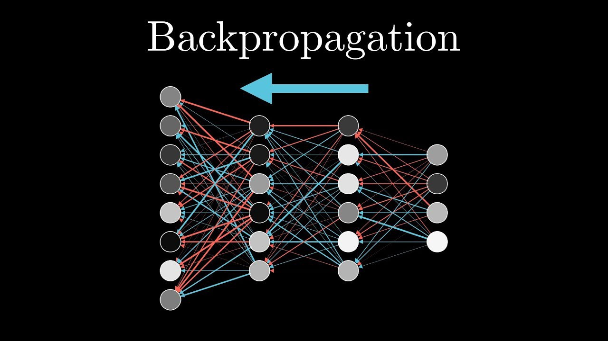

# Machine-Learning-from-Scratch
* [README english](README.md)
* [README vietnames](README_vi.md)
---
## Contents
1. [Tổng quan](#tổng-quan)
2. [Yêu cầu](#yêu-cầu)
3. [Dùng như thế nào](#dùng-như-thế-nào)
4. [Các thuật toán supervised learning](#các-thuật-toán-supervised-learning)
5. [Các thuật toán unsupervised learning](#các-thuật-toán-unsupervised-learning)
6. [Neural Network](#neural-network)
7. [Các hàm Loss, metric, activation](#loss-metric-activation)
8. [ToDo](#todo)

## Tổng quan
Repo này xây dựng lại các thuật toán Machine Learning cơ bản từ đầu. Mục đích chính của repo này để giúp mọi người hiểu rõ các thuật toán Machine Learning, hiểu rõ hơn các thư viện như Sklearn hoạt động như thế nào.

Vì mình thích sử dụng thử viện nên sẽ viết sao cho cách sử dụng giống các thư viện (Tensorflow, Sklearn) nhất có thể.

Repo này hiện cung cấp các thuật toán Machine Learning sau:
* Supervised learning
    1. [K Nearest Neighbors](#knn)
    2. [Linear Regression](#linear-regression)
    3. [Logistic Regression](#logistic-regression)
    4. [Perceptron](#perceptron)
    5. [Decision Tree](#decision-tree)
    6. [Random Forest](#random-forest)
    7. [Support vector machine](#svm)
    8. [Naive Bayes](#naive-bayes)
* Unsupervised learning
    1. [K-means Clustering](#kmean)
    2. [Principal Component Analysis](#pca)
* Neural network

## Yêu cầu
* Python
* Numpy
* Matplotlib
* Scipy
* Pandas
* Sklearn

## Dùng như thế nào
1. Tải repo: `git clone https://github.com/ZeroSum0x00/Machine-Learning-from-Scratch.git` hoặc trực tiếp trên github
2. Vào thư mục repo và cài các thư viện cần thiết: `pip install -r requirements.txt`
3. Vào thử mục `example` của repo và chạy file: `python $ten_file.py`

## Các thuật toán supervised learning
### K Nearest Neighbors


## Neural network
Neural network hay còn gọi là mạng nơ-ron nhân tạo, được lấy cảm hứng từ sự hoạt động của các nơ-ron thần kinh trong não.

Trong hệ thống thần kinh của con người, nơ-ron là đơn vị cấu tạo cơ bản và là một phần quan trọng nhất cấu tạo nên bộ não con người.
Ở mỗi nơ-ron có phần thân (soma) chứa nhân, các tín hiệu đầu vào qua sợi nhánh (dendrites) và các tín hiệu đầu ra qua sợi trục (axon) kết nối với các nơ-ron khác.
Hay nói cách khác, mỗi nơ-ron nhận xung điện đầu vào từ sợi nhánh, khi xung điện đủ lớn để đi qua nhân thì sẽ đi qua sợi trục truyền vào các nơ-ron khác.

<p align="center">
  
</p>

Tương tự như thế, mạng nơ-ron nhân tạo nhận dữ liệu từ `input layer`, sau đó truyền dữ liệu qua các `hidden layer` cuối cùng đi đến lớp `output layer` để đưa ra dự đoán.

Mỗi khi dữ liệu được truyền vào một nơ-ron mạng, sẽ có một hàm activation để quyết định xem liệu có cho phép dữ liệu đó đi qua hay không.

<p align="center">
  
</p>

### Suy luận tiến (forward propagation)
Từ các giá trị đầu vào tương ứng của node nơ-ron `x`, tính toán giá trị đầu ra của node nơ-ron đó dựa trên hàm kích hoạt `σ` và các giá trị weight `w` và bias `b` bằng công thức `y = σ(w*x + b)`. 

<p align="center">
  
</p>

Quá trình này lặp lại trên các nơ-ron cho đến khi đưa ra dự đoán cuối cùng tại `output layer`.

### Lan truyền ngược (backward propagation)
Tối ưu các trọng số (weight và bias) bằng thuật toán gradient descent

<p align="center">
  
</p>

### Các ví dụ
1. Linear problem
```python
    # Tạo bộ dữ liệu linear
    X, y = datasets.make_blobs(n_samples=1000, centers=2, random_state=2)
    # Chia dữ liệu thành 2 tập train, test
    X_train, X_test, y_train, y_test = train_test_split(X, y, test_size=0.2, random_state=123)
    # Chuẩn hóa dữ liệu
    X_train, X_test, y_train, y_test = X_train.T, X_test.T, y_train.T, y_test.T
    train_ds = (X_train, y_train)
    val_ds = (X_test, y_test)
    
    # Khai báo các hyperparameters
    epochs = 1200
    plot_step = int(epochs / 10)
    batch_size = 16
    steps_per_epoch = int(X_train.shape[1] / batch_size)
    
    # Định nghĩa mô hình nơ-ron với 2 lớp ẩn mỗi lớp ẩn có 4 nơ-ron, hàm activation là sigmoid
    model = Neural_Network([2, 4, 4, 1], activation='sigmoid', seed=0)
    # Dùng gradient descent để tối ưu hóa các giá trị weight
    model.compile(optimizer='SGD', loss='mse', metrics='accuracy')
    # fit mô hình vào dữ liệu
    history = model.fit(train_ds, batch_size=batch_size, epochs=epochs, validation_data=val_ds,
                        steps_per_epoch=steps_per_epoch, plot_during_train=True, plot_step=plot_step)
```
| Mô phỏng kết quả trên tập dữ liệu Linear problem |
|---|
|  |
|  |

2. Noisy moons
```python
    X, y = datasets.make_moons(n_samples=1000, noise=0.025)
    X_train, X_test, y_train, y_test = train_test_split(X, y, test_size=0.2, random_state=123)
    X_train, X_test, y_train, y_test = X_train.T, X_test.T, y_train.T, y_test.T
    train_ds = (X_train, y_train)
    val_ds = (X_test, y_test)

    epochs = 1200
    plot_step = int(epochs / 10)
    batch_size = 16
    steps_per_epoch = int(X_train.shape[1] / batch_size)

    model = Neural_Network([2, 4, 4, 1], activation='sigmoid', seed=0)
    model.compile(optimizer='SGD', loss='mse', metrics='accuracy')
    history = model.fit(train_ds, batch_size=batch_size, epochs=epochs, validation_data=val_ds,
                        steps_per_epoch=steps_per_epoch, plot_during_train=True, plot_step=plot_step)
```
| Mô phỏng kết quả trên tập dữ liệu Noisy moons |
|---|
|  |
|  |

3. Circles
```python
    X, y = datasets.make_circles(n_samples=1000, noise=0.025)
    X_train, X_test, y_train, y_test = train_test_split(X, y, test_size=0.2, random_state=123)
    X_train, X_test, y_train, y_test = X_train.T, X_test.T, y_train.T, y_test.T
    train_ds = (X_train, y_train)
    val_ds = (X_test, y_test)

    epochs = 1200
    plot_step = int(epochs / 10)
    batch_size = 16
    steps_per_epoch = int(X_train.shape[1] / batch_size)

    model = Neural_Network([2, 4, 1], activation='sigmoid', seed=0)
    model.compile(optimizer='SGD', loss='mse', metrics='accuracy')
    history = model.fit(train_ds, batch_size=batch_size, epochs=epochs, validation_data=val_ds,
                        steps_per_epoch=steps_per_epoch, plot_during_train=True, plot_step=plot_step)
```
| Mô phỏng kết quả trên tập dữ liệu Circles |
|---|
|  |
|  |

4. XOR problem
```python
    # Hàm tạo dữ liệu XOR
    def generate_points(n, centers, labels, amplitude):
        x1_noisy = []
        x2_noisy = []
        y = []
        for center, c in zip(centers, labels):
            x1, x2 = center
            noise_x1 = np.random.rand(n)
            noise_x2 = np.random.rand(n)
            x1_noisy += (noise_x1 + x1).tolist()
            x2_noisy += (noise_x2 + x2).tolist()
            y += [c] * n
        X = list(zip(x1_noisy, x2_noisy))
        X = np.array(X)
        y = np.array(y)
        y = np.expand_dims(y, 1)
        X = X.T
        y = y.T
        return X, y
    
    X, y = generate_points(500, [(0, 0), (0, 1), (1, 0), (1, 1)], [0, 1, 1, 0], 0.005)
    X_train, X_test, y_train, y_test = train_test_split(X, y, test_size=0.2, random_state=123)
    X_train, X_test, y_train, y_test = X_train.T, X_test.T, y_train.T, y_test.T
    train_ds = (X_train, y_train)
    val_ds = (X_test, y_test)

    epochs = 1200
    plot_step = int(epochs / 10)
    batch_size = 16
    steps_per_epoch = int(X_train.shape[1] / batch_size)

    model = Neural_Network([2, 4, 1], activation='sigmoid', seed=0)
    model.compile(optimizer='SGD', loss='mse', metrics='accuracy')
    history = model.fit(train_ds, batch_size=batch_size, epochs=epochs, validation_data=val_ds,
                        steps_per_epoch=steps_per_epoch, plot_during_train=True, plot_step=plot_step)
```
| Mô phỏng kết quả trên tập dữ liệu XOR |
|---|
|  |
|  |

